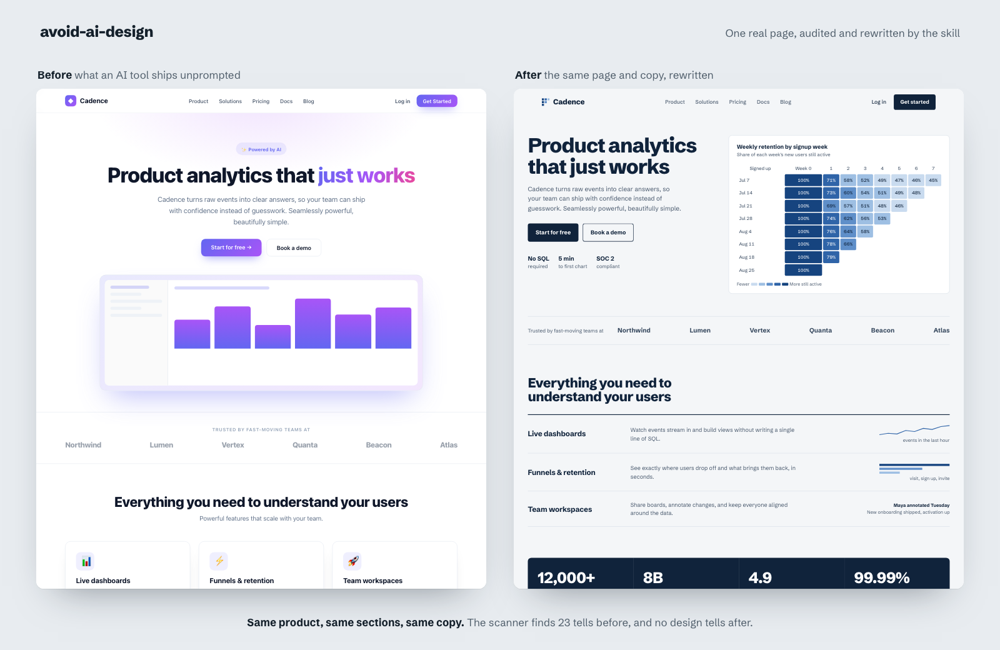
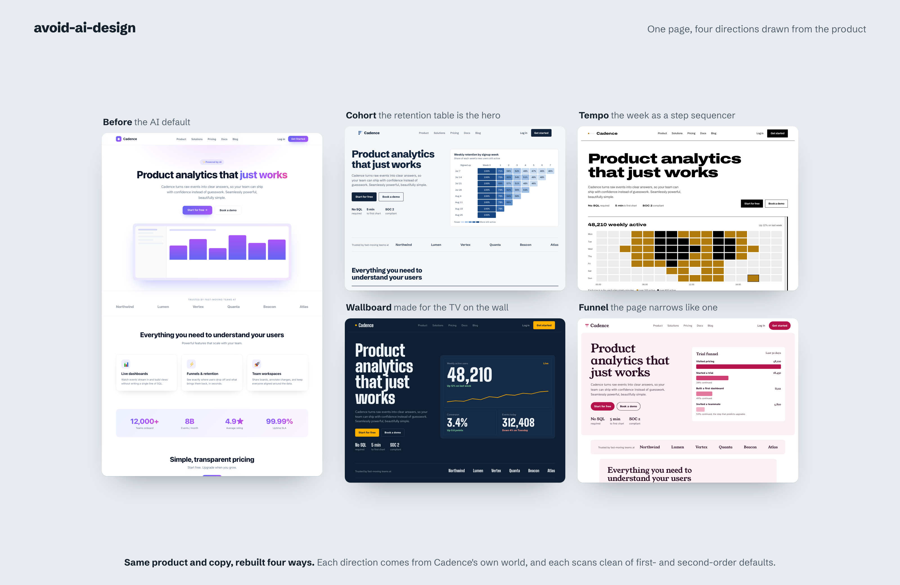
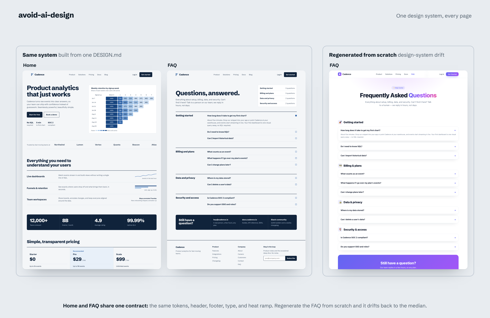

<!-- SEO: title + meta description live in docs/SEO.md -->

# avoid-ai-design

**A Claude Code skill that audits AI-generated frontend code and rewrites it so it stops looking AI-generated, including the "tasteful" defaults that replaced the purple gradient.**

[](LICENSE)
[](https://agentskills.io)
[](https://claude.com/claude-code)
[](#compatibility)

<p align="center">
  
</p>

<p align="center"><sub><i>One real page, run through the skill. Same product, same sections, same copy; only the design changed. The scanner finds 23 tells before and no design tells after. Pages and the full audit: <a href="examples/demo/">examples/demo/</a>.</i></sub></p>

Ask Claude, Codex, or any model to "build a landing page" and you get the same page every time: a purple-to-blue gradient, Inter for every word, a centered hero over three rounded feature cards, a glassy navbar. Ask it to make that look less AI and you get the *next* same page: warm cream with a terracotta accent, or near-black with one acid-green signal, all-caps monospace labels, one colored word in the headline, features numbered 01 / 02 / 03.

`avoid-ai-design` catches both. It scans the frontend an AI just produced, flags the patterns that give it away, and rewrites the interface around a direction drawn from your product rather than from a list of looks. On multi-page work it writes that direction down once, in a `DESIGN.md`, so page two cannot drift from page one.

It is the design counterpart to [`avoid-ai-writing`](https://github.com/conorbronsdon/avoid-ai-writing): same idea, applied to UI instead of prose.

---

## The problem: AI design converges, twice

Models are trained toward the average, so their UI clusters around safe defaults you can recognize on sight:

- **Type** that is always Inter, Roboto, or the system stack, with no pairing and no display face.
- **Color** that is a purple or indigo gradient fading into blue.
- **Layout** that centers everything: hero, subhead, two buttons, then a three-card feature grid.
- **Components** wrapped in `rounded-2xl`, `shadow-lg`, and `backdrop-blur`, straight from the shadcn defaults.
- **Copy** that opens with "Elevate your workflow" and ends with a "Get Started" button.

Then the fix converged too. Anthropic's own `frontend-design` skill now lists the clusters AI design gathers around once it avoids the purple: cream with a terracotta accent (Claude's own interface color), near-black with one acid-green or vermilion signal, broadsheet hairlines, the SaaS card kit, and template chrome like tracked all-caps eyebrows and `A · B · C` meta strings. These *second-order defaults* read as AI to anyone who has seen a few hundred generated pages. This skill's own first demo landed in them, which is how v0.4 came to check for them by name.

## What it catches

The full catalog lives in [`references/ai-tells-catalog.md`](references/ai-tells-catalog.md): 67 tells, each with a detection signal, why it reads as AI, a fix for plain HTML/CSS and for React + Tailwind + shadcn, and its sources.

| Category | Example tells |
|---|---|
| **Second-order defaults** | cream + terracotta (the Claude look), near-black + one acid-green accent, broadsheet cosplay, all-caps and mono template chrome, one accented headline word, decorative 01 / 02 / 03, fake window dots, the emerald fallback |
| **Typography** | Inter everywhere, the "tasteful free font" set (Space Grotesk, Geist, Instrument Serif, Fraunces), a face declared in CSS but never loaded |
| **Color** | the purple/indigo gradient, gradient headline text, untouched shadcn palettes, one hue pretending to be two, muted text below WCAG AA |
| **Layout** | the centered hero, three icon cards, the stock section order (hero, logos, features, stats, pricing, CTA), three-tier pricing rings, the four-column footer |
| **Components** | `rounded-2xl shadow-lg` on everything, reflexive glass, icon-in-a-rounded-square, stock Aceternity / Magic UI effects, missing focus states |
| **Motion** | the same fade-up on every section, bounce easing, count-up stats, animation that ignores reduced-motion |
| **Icons, copy, imagery** | the worn Lucide set and the sparkle-for-AI, "Elevate / Seamless / Powerful", arrows welded to CTAs, generic CTA labels, placeholder avatars |
| **Consistency** | design-system drift: font, color, radius, nav, or footer that changes from page to page, or ignores the design you chose |

Every tell is ranked by **who notices it**: P0 a layperson, P1 a designer or developer, P2 craft and polish. And the catalog is explicit about what *not* to flag: a tell is evidence of a default nobody chose, never proof that a model made the page.

## Scan in one command

`scripts/detect.mjs` finds the code-certain tells with no model call and no dependencies (Node 18+):

```bash
node ~/.claude/skills/avoid-ai-design/scripts/detect.mjs src/
```

```
src/app/page.tsx  P0 5 · P1 12 · P2 4
  P0  C1   Purple / indigo gradient  L13
        The canonical unchosen gradient (the Tailwind indigo-500 lineage).
  P0  C6   Gradient-filled headline text  L13
        bg-clip-text gradients are a 2024-era default flourish that also hurts legibility.
  P0  L1   Pill badge + centered hero  L13
  ...
```

- `--json` for machine-readable output, `--min=P1` to hide polish-level findings.
- Exit code `2` when any P0 or P1 is found, `0` when clean, so it works as a CI gate.
- It skips `examples/`, `fixtures/`, `stories/`, and files marked `slop-example`, and it honors ignore comments for choices your brief asked for: `avoid-ai-design-ignore: SD1` on a line, or `avoid-ai-design-ignore-file: SD1, SD4` in a file.

The scanner covers the half of the audit that lives in source. Palette weight, spacing rhythm, hierarchy, and structure-level sameness need a render, and the skill does that part.

**Optional: check every UI edit in Claude Code.** Add a `PostToolUse` hook to `.claude/settings.json`. When an edit introduces P0 or P1 tells, Claude sees the list right away and can fix it in the same turn:

```json
{
  "hooks": {
    "PostToolUse": [
      {
        "matcher": "Edit|Write|MultiEdit",
        "hooks": [
          { "type": "command", "command": "node ~/.claude/skills/avoid-ai-design/scripts/detect.mjs --hook" }
        ]
      }
    ]
  }
}
```

## Two modes

| Mode | What it does | When to use |
|---|---|---|
| `rewrite` *(default)* | Scan, audit, plan a direction, review the plan against the defaults, rewrite, re-scan | You want the UI fixed |
| `detect` | Scan and audit only, no edits | You want to see the tells and decide yourself, or you are reviewing code you should not change |

Trigger `detect` with phrases like "just audit", "flag only", "don't change the code", or "scan this for AI tells".

## How it works

1. **Scope.** What is under review, the stack, the mode, and any design system you already have: a `DESIGN.md`, tokens, sibling pages, or a font and color you chose.
2. **Scan.** Run the scanner for the code-certain tells.
3. **Render.** Screenshot the UI when a tool is available, judge the visual tells from pixels, and run the silhouette test: shrink the page to a black-and-white block outline and ask whether it could be anyone's.
4. **Audit.** Merge everything into one report: each tell with its ID, location, severity, and why it reads as AI.
5. **Ground the plan in the subject.** If a system exists, it is the direction. Otherwise, derive one from what the product is made of (its materials, its artifacts, its vernacular) and write it down as 4-6 colors with roles, the faces, a layout idea, and one signature detail.
6. **Review the plan against the defaults.** For every move: would you have made it for any similar page? If so, it is a default. Revise it before any code is written. You confirm the plan.
7. **Rewrite.** Edit the real files at the right depth: surgical inside a design system, a rebuild for a standalone page. Functionality, props, data flow, accessibility, and the meaning of your copy stay intact. Multi-page work gets a `DESIGN.md` ([template](references/design-md-template.md), Google's open format) that every page is built from.
8. **Re-scan and judge.** No P0, no second-order default the brief did not ask for, and four tests: justified, coherent, not a second-order default, consistent across pages.

## See it work on a real page

[`examples/demo/`](examples/demo/) is a real end-to-end run on one generic AI-built SaaS page. Every file holds the same product, sections, and copy; only the design varies.

**1. The run.** [`slop.html`](examples/demo/slop.html) is the page an AI tool produces unprompted. [`refined.html`](examples/demo/refined.html) is the same page after the skill, grounded in the product's most characteristic artifact: the retention cohort table is the hero, the page is built like a table, and the table's heat ramp is the only color. [`AUDIT.md`](examples/demo/AUDIT.md) is the full run, including an honest section on what the previous version of this demo got wrong. Full-page screenshots: [before](docs/demo-before.png) and [after](docs/demo-after.png).

**2. More than one right answer.** The same page, rebuilt four ways, each drawn from a different part of the product's world, each scanning clean of first- and second-order defaults:

<p align="center">
  
</p>

- [`refined.html`](examples/demo/refined.html): **Cohort**, the retention table.
- [`after-tempo.html`](examples/demo/after-tempo.html): **Tempo**, the name. A cadence is a rhythm, so the week becomes a step sequencer.
- [`after-wallboard.html`](examples/demo/after-wallboard.html): **Wallboard**, where the product lives: the TV on the team's wall.
- [`after-funnel.html`](examples/demo/after-funnel.html): **Funnel**, the question every user asks, and a page that narrows like one.

**3. One design system, every page.** [`faq.html`](examples/demo/faq.html) is a second page built on `refined.html`'s exact tokens, header, and footer: the same product. [`faq-drift.html`](examples/demo/faq-drift.html) is the same FAQ regenerated from scratch, drifting back to the median.

<p align="center">
  
</p>

## Install

With the [skills CLI](https://skills.sh), which detects the agents you have installed:

```bash
npx skills add funboy322/avoid-ai-design
```

Or clone into your agent's skills directory. `~/.agents/skills/` is the cross-client convention, so Claude Code, Cursor, Codex, and other compatible tools all pick it up:

```bash
git clone https://github.com/funboy322/avoid-ai-design.git ~/.agents/skills/avoid-ai-design
```

Claude Code also reads `~/.claude/skills/`:

```bash
git clone https://github.com/funboy322/avoid-ai-design.git ~/.claude/skills/avoid-ai-design
```

For a single project instead of globally, clone into `.agents/skills/` (or `.claude/skills/`) under the repo root. Then start (or restart) Claude Code and run `/skills`: you should see `avoid-ai-design` in the list. No build step.

## Use it

Once installed, ask in plain language. The skill triggers on intent, not a fixed command:

```
de-slop this landing page
make this component look less AI-generated
audit App.tsx for AI design tells, don't change anything
this site looks like every Claude-made site, fix it
add a pricing page that matches the rest of the site
```

You can name a direction up front ("rewrite this around our shipping-label look") or let the skill derive one from the product.

## Compatibility

`avoid-ai-design` is a plain [`SKILL.md`](https://agentskills.io) with reference files and one optional script. It needs no APIs or keys, so it runs anywhere the format is supported:

- Claude Code (CLI, desktop, web, IDE extensions)
- Cursor
- OpenAI Codex CLI
- GitHub Copilot (VS Code)
- Any other agent that reads the agentskills.io `SKILL.md` format

The scanner needs Node 18 or newer. Without it, the skill walks the catalog by hand.

## How it differs

**From Anthropic's [`frontend-design`](https://github.com/anthropics/skills/tree/main/skills/frontend-design).** `frontend-design` guides UI *as it is being built*, from a brief. `avoid-ai-design` works on code that **already exists**: it audits, scores, and rewrites output you or another model produced. They share a goal, and this catalog cites `frontend-design`'s list of AI-design clusters directly. Use one to write, the other to check.

**From the larger anti-slop frameworks** such as [Impeccable](https://github.com/pbakaus/impeccable), [taste-skill](https://github.com/leonxlnx/taste-skill), and [Hallmark](https://github.com/nutlope/hallmark). They cover the whole design workflow with large rule sets, commands, and themes. `avoid-ai-design` stays small on purpose: one audit-and-rewrite pass, a catalog that cites a source for each claim, severity ranked by who notices, a section on what *not* to flag, checks for the second-order defaults by name, and one `DESIGN.md` for multi-page work, in Google's open format that Stitch and a growing set of design tools also use. They compose: generate with any of them, then run this as the check.

## FAQ

**What is "AI slop" in web design?**
The cluster of default visual choices AI tools reach for unprompted: purple-to-blue gradients, Inter, centered heroes with three feature cards, untouched shadcn, glass everywhere. It is generic because the model averages its training data.

**Does it also flag the "tasteful" fixes?**
Yes. Cream with terracotta, near-black with one acid-green accent, all-caps mono labels, one colored headline word, decorative 01 / 02 / 03: these are the second-order defaults, and the skill checks for them by name. If your brief genuinely asks for one, keep it and mark it with an ignore comment.

**Is a finding proof that AI made my site?**
No. A tell shows a default nobody chose. Designers shipped rounded cards long before LLMs, and plenty of this is Tailwind and shadcn as installed. The skill reports defaults and fixes them; it never claims authorship.

**How do I make AI-generated UI look less generic?**
Start from the product, not from a style. Ask what its world is made of, open with the most characteristic thing in that world, and check each design move against the question "would I have done this for any similar page?" The skill runs that process for you, or flags exactly what to change in `detect` mode.

**Will it keep my pages consistent?**
Yes. If a design already exists (other pages, a tokens file, a `DESIGN.md`, a font and color you chose), the skill treats it as the contract. For new multi-page work it writes one `DESIGN.md` and builds every page from it, because regenerating each page from scratch is exactly how "AI design-system drift" happens.

**Does it work with code from Codex and other models?**
Yes. The tells are model-agnostic because the convergence is.

**Will it break my working code?**
No. The rewrite preserves functionality, props, state, routing, accessibility, and the meaning of your copy. Inside an existing design system it stays surgical. If the UI is already distinctive, it says so and stops.

**Do I need to install anything else?**
No. Node 18+ is only needed for the optional scanner.

## Repository layout

```
avoid-ai-design/
├── SKILL.md                          # workflow, modes, calibration, severity, output format
├── scripts/
│   ├── detect.mjs                    # zero-dependency scanner for the code-certain tells
│   └── detect.test.mjs               # regression tests: node --test scripts/detect.test.mjs
├── references/
│   ├── ai-tells-catalog.md           # the catalog, with sources and HTML + React fixes
│   ├── aesthetic-directions.md       # grounding questions and a vocabulary of directions
│   └── design-md-template.md         # the multi-page contract, in Google's DESIGN.md format
├── examples/
│   └── demo/                         # one AI page, its audit, four grounded rebuilds, a two-page consistency demo
├── README.md
├── LICENSE
└── docs/                             # images and maintainer notes
```

## Contributing

Found a tell the catalog misses? Open a pull request that adds it to [`references/ai-tells-catalog.md`](references/ai-tells-catalog.md) in the existing format: the detection signal, why it reads as AI, a fix for both HTML/CSS and React/Tailwind, and a source. If it is code-certain, add a rule to `scripts/detect.mjs` and a case to `scripts/detect.test.mjs`, and run `node --test scripts/detect.test.mjs`. False positives are bugs; report them with the snippet that triggered one.

## License

[MIT](LICENSE).

---

<sub>**Keywords:** Claude Code skill · remove AI slop · de-slop UI · AI design patterns · generic AI aesthetics · AI-generated website detector · design slop scanner · frontend design audit · DESIGN.md · Tailwind / shadcn / React · Codex · agentskills.io · avoid AI design.</sub>
